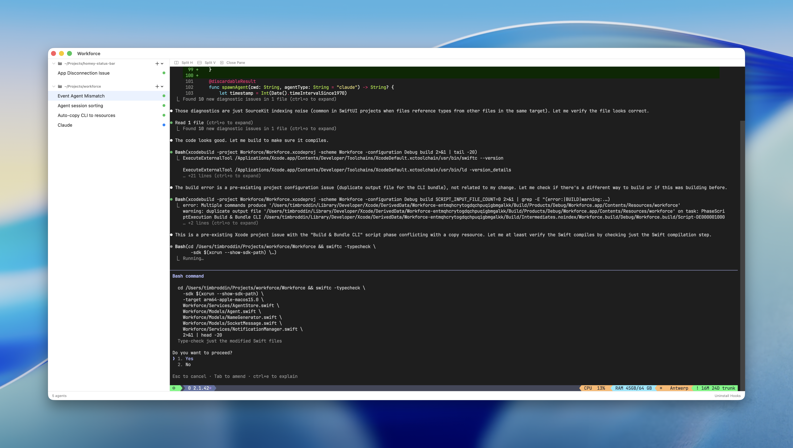

# Workforce

> ⚠️ **SUPER EXPERIMENTAL & BUGGY ATM** ⚠️ — Workforce is under active development. Expect rough edges and breaking changes.

Stop losing track of your AI coding agents. Workforce is a native macOS app that uses tmux to keep all your agent sessions visible and manageable in one place.

Built with deep integration for [Claude Code](https://docs.anthropic.com/en/docs/claude-code) via its hook system, with basic support for other agents.



## Features

- **Agent Dashboard** — See all running agents at a glance with live status indicators (active, idle, waiting for input/permission)
- **Embedded Terminals** — View agent terminal sessions directly in the app via SwiftTerm
- **Notifications** — Get macOS alerts when agents need interaction
- **Event Viewer** — Debug hook messages with a real-time event log and type filtering
- **Tmux Integration** — Agents run in tmux sessions that persist independently of the app
- **Agent Management** — Spawn new agents, kill sessions, open in your preferred terminal or IDE

## Requirements

- macOS 15.0 (Sequoia) or later
- [tmux](https://github.com/tmux/tmux)
- [Claude Code](https://docs.anthropic.com/en/docs/claude-code) (for full hook integration)

## Installation

### Homebrew (coming soon)

```sh
brew install --cask timbroddin/workforce/workforce
```

### Download

Grab the latest release from the [Releases](https://github.com/timbroddin/workforce/releases) page.

### Setup

Once the app is running, click **Install Binary & Hooks** in the settings to install the `workforce` CLI and register the Claude Code hooks.

## Usage

1. Launch the Workforce app
2. Spawn agents from the app, or start Claude Code sessions that will be picked up automatically via hooks
3. Monitor agent status, view terminals, and receive notifications when agents need input

### CLI Commands

```sh
workforce run [prompt]       # Launch a new agent in tmux
workforce install-hooks      # Register hooks in Claude Code settings
workforce uninstall-hooks    # Remove hooks from Claude Code settings
```

## How It Works

Workforce wraps each agent session in a tmux session, making them discoverable and persistent. A Unix socket (`/tmp/workforce-<uid>.sock`) handles IPC between the CLI and the app — when Claude Code triggers a hook, the `workforce` CLI forwards the event over the socket, and the app updates the UI in real-time.

## Project Structure

```
Workforce/          macOS SwiftUI application
WorkforceKit/       Swift package containing:
  WorkforceKit      Shared models and utilities
  WorkforceCLI      CLI binary (workforce command) used by Claude Code hooks
```

## License

MIT
